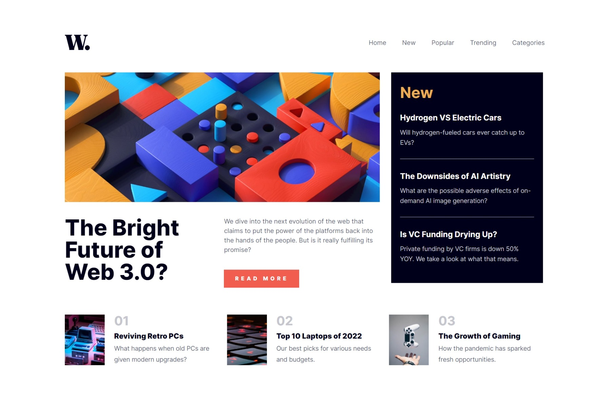

# Frontend Mentor - News homepage solution

This is a solution to the [News homepage challenge on Frontend Mentor](https://www.frontendmentor.io/challenges/news-homepage-H6SWTa1MFl). Frontend Mentor challenges help you improve your coding skills by building realistic projects.

## Table of contents

- [Overview](#overview)
  - [The challenge](#the-challenge)
  - [Screenshot](#screenshot)
  - [Links](#links)
- [My process](#my-process)
  - [Built with](#built-with)
  - [What I learned](#what-i-learned)
  - [Continued development](#continued-development)
- [Author](#author)

## Overview

### The challenge

Users should be able to:

- View the optimal layout for the interface depending on their device's screen size
- See hover and focus states for all interactive elements on the page

### Screenshot



### Links

- Solution URL: [Add solution URL here](https://your-solution-url.com)
- Live Site URL: [Add live site URL here](https://your-live-site-url.com)

## My process

### Built with

- JSX
- CSS custom properties
- Flexbox
- CSS Grid
- Mobile-first workflow -[Sass](https://sass-lang.com/) - CSS preprocessor
- [React](https://reactjs.org/) - JS library
- [vite](https://vitejs.dev/) - Build tool

### What I learned

```html
<h1>Some HTML code I'm proud of</h1>
```

```css
//to make the whole body dimmer when mobile menu is active(is-open)
body::before {
content: "";
position: fixed;
top: 0;
left: 0;
width: 100%;
height: 100%;
background-color: rgba(0, 0, 0, 0.5);
z-index: 10; //don't forget to make z-index greater than all body elements but less than mobile menu
display: none }

body.is-open::before{
display: inline; }

//JS
const bodyBefore = document.querySelector('body::before');
bodyBefore.classList.toggle('is-open');
```

```js
//to toggle class name is-open
navMenu.classList.toggle("is-open");
```

```css
//To make all flex items have equal width(all flex items have the same starting point and grow equally to fill the available space)
flex-basis: 0;
flex-grow: 1;

//To prevent text from going to a new line
white-space: nowrap;
```

### Continued development

-Making grid layout responsive

-A way to make a button inside a cell not fill up the whole cell without sacrificing responsivness

## Author

- Frontend Mentor - [@DagimTizazu](https://www.frontendmentor.io/profile/DagimTizazu)
- Email address - dagimtizazu4444@gmail.com
- Telegram - @dag400
